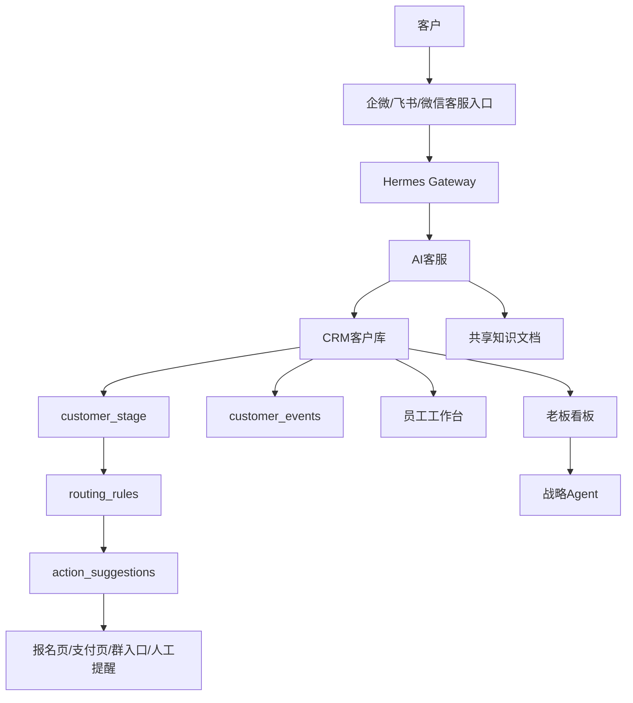

# PRD v0.2：AI客户经营系统

## 1. 产品定位

**产品名称**：AI客户经营系统

**一句话定位**：面向小微企业的 AI 客户经营系统，连接企业微信、飞书、微信、小程序/H5 和 Web 后台，覆盖客户接待、客户入库、客户分层、智能分流、员工跟进、成交承接和老板决策。

**对外口径**：

> 不改变企业现有的企微、飞书、微信沟通方式。客户照常咨询，AI 自动接待、记录来源、识别意图、更新客户阶段，并根据业务规则把客户分流到报名、预约、付款、进群、人工跟进或长期养熟路径。员工通过工作台提升成交效率，老板通过经营看板和战略 Agent 看清渠道、客户、员工和转化。

v0.2 默认行业模板为 **活动/社群**，但产品表达保留跨行业能力：活动、教培、电商、电销/B2B、招商加盟、本地服务。

## 2. 目标与边界

**业务目标**

- 降低重复咨询成本：常见问题由 AI 自动接待。
- 提高线索承接率：客户自动入库、自动生成摘要、自动推荐下一步。
- 沉淀客户资产：来源、聊天、阶段、标签、事件、负责人都结构化。
- 帮老板看清业务：渠道、客户阶段、员工跟进、AI解决率、常见问题可视化。
- 支撑销售演示：后台视觉贴近高保真蓝白工作台和老板看板。

**v0.2 范围**

- 做：员工工作台、客户管理、知识库 URL、规则配置、老板看板、战略 Agent 入口、营销素材 Skill、客户事件和阶段数据底座。
- 不做：真实支付、真实自动拉群、完整 H5/小程序成交页、完整权益系统、多租户计费、会话存档合规套件、真实图片生成 API。

**成功标准**

- 员工能看到客户、标签、阶段、推荐动作、待办提醒和知识库待优化问题。
- 老板能看到新增客户、高意向客户、阶段漏斗、渠道效果、高频问题、员工跟进和战略建议。
- 客户阶段以 `users.customer_stage` 为准，AI 画像只做建议，不覆盖报名/付费/入群等业务阶段。
- Hermes 同步消息会写入 `customer_events`，看板不依赖假数据。

## 3. 角色视角

| 角色 | 目标 | 入口 | 可见内容 |
|---|---|---|---|
| 客户/用户 | 咨询、报名、预约、购买、进群 | 企微/飞书/微信，后续 H5/小程序 | 只看到客服对话和成交链接 |
| 员工/销售/运营 | 服务客户、跟进客户、优化知识库 | Web 工作台 + 企微提醒 | 客户列表、摘要、标签、推荐动作、待办、知识库问题 |
| 老板/管理者 | 看经营数据、做决策 | Web 看板 + 战略 Agent | 渠道、阶段、漏斗、员工、AI效果、经营建议 |
| 管理员/研发 | 配置和维护系统 | Web 后台 + 服务器 | Hermes、数据库、规则、日志、模型配置 |

## 4. 产品结构



三层产品形态：

- 对话层：企微/飞书/微信，负责客户咨询、AI接待、员工提醒。
- 成交层：H5/小程序，后续承载报名、预约、支付、权益页。
- 管理层：Web 后台，负责 CRM、知识库、规则、员工工作台、老板看板。

## 5. 核心业务模型

v0.2 内部实现保持轻量状态机：

```text
Customer 客户
Stage 客户阶段
Event 客户事件
Routing Rule 分流规则
Action Suggestion 推荐动作
```

**客户阶段 `customer_stage`**

| 阶段 | 含义 |
|---|---|
| new | 新客户 |
| consulted | 已咨询 |
| interested | 感兴趣 |
| high_intent | 高意向 |
| registered | 已报名 |
| pending_review | 待审核 |
| approved | 审核通过 |
| paid | 已付费 |
| joined_group | 已入群 |
| attended | 已参加 |
| converted | 已成交 |
| follow_up | 待跟进 |
| lost | 流失 |
| dormant | 沉睡/养熟 |

**客户事件 `customer_events`**

| 事件 | 说明 |
|---|---|
| message_received | 收到客户消息 |
| ai_replied | AI 已回复 |
| stage_changed | 阶段发生变化 |
| human_assigned | 已分配人工 |
| group_link_sent | 已发送群入口 |
| form_submitted | 已提交表单 |
| payment_success | 支付成功 |
| routing_suggested | 已生成推荐动作 |
| analysis_completed | AI画像更新完成 |

**默认分流规则**

| 客户阶段 | 推荐动作 |
|---|---|
| new | AI继续接待 |
| consulted / interested | 发报名页 |
| high_intent / follow_up | 推人工跟进 |
| registered / approved | 发活动群入口 |
| pending_review | 提醒员工审核 |
| paid | 发权益页 |
| dormant | 进入养熟 SOP |

## 6. 功能需求

### 6.1 员工工作台

目标：让员工不用翻聊天记录，就知道今天该处理哪些客户。

P0 内容：

- KPI：今日新增客户、高意向客户、待跟进、AI解决率。
- 客户表格：客户、来源、阶段、意向、负责人、下一步动作、最近互动。
- 客户摘要：展示选中客户的 AI 摘要、标签、阶段、推荐动作。
- AI推荐动作：基于 `routing_rules` 给出处理建议。
- 待办提醒：高意向、审核/人工处理、今日新增。
- 知识库待优化问题：从近 7 天客户问题中提取高频问题。

### 6.2 客户管理

目标：沉淀客户资产，支持员工查看、分析和手动调整阶段。

P0 内容：

- 客户列表支持搜索和阶段筛选。
- 客户详情展示基础信息、AI画像、推荐动作、客户事件、对话记录。
- 支持手动更新 `customer_stage`，并写入 `stage_changed` 事件。
- 保留“重新分析”能力。

### 6.3 知识库

目标：员工维护共享活动资料，AI 客服可引用。

P0 内容：

- 飞书文档 / 知识库 URL 列表。
- 默认高频问题占位，提示员工补充 FAQ。
- 不做 RAG、embedding、向量库。

### 6.4 规则配置

目标：用轻量规则表表达“客户到某个阶段后下一步做什么”。

P0 内容：

- 查看默认活动/社群分流规则。
- 可启停规则。
- 可编辑目标资源、规则说明、优先级。
- v0.2 只生成建议，不执行真实支付、拉群或发消息。

### 6.5 老板经营看板

目标：老板不看聊天记录，也能看清客户经营状况。

P0 内容：

- KPI：今日新增客户、高意向客户、已成交客户、AI解决率。
- 转化漏斗：咨询、报名、审核、付款、入群、成交。
- 渠道效果：按来源统计客户数。
- 客户阶段分布。
- 员工跟进效率。
- 高频关注问题。
- 经营提醒。

### 6.6 战略 Agent

目标：老板可以用自然语言问经营问题。

P0 内容：

- 在老板看板右侧提供问答框。
- 输入经营问题后，系统聚合当前 CRM 数据并调用 Hermes API。
- Hermes 不可用时，返回确定性经营摘要。

### 6.7 营销素材 Skill

目标：给 Agent 配上小红书图文生成能力，帮助运营把活动、社群、课程包装成可发布内容。

P0 内容：

- 输入主题、目标人群、营销目标、内容语气和补充资料。
- 输出标题备选、封面文案、开头 hook、图文分镜、每页配图提示词、正文、标签、CTA 和设计建议。
- 保存历史素材，方便运营回看和复用。
- Hermes API 可用时由 Agent 生成；不可用时使用本地活动/社群模板兜底。
- v0.2 只生成文案和图片提示词，不调用真实图片生成 API。

## 7. 非功能需求

- 数据隔离：用户身份继续由 `platform + bot_id + external_user_id` 生成。
- 记忆隔离：不使用 Hermes 全局 memory 存用户私有记忆。
- 部署：维持单机 Ubuntu + FastAPI + PostgreSQL + Nginx + systemd。
- 迁移：v0.2 引入 Alembic，已有 v0 数据库通过 baseline stamp 升级。
- UI：高保真参考蓝白工作台和老板看板，目标是信息架构和演示感贴近，不逐像素复刻。

## 8. 后续版本

- v0.3：H5 报名/预约页，表单提交回流 `customer_events`。
- v0.4：真实动作执行器，支持发送群入口、人工提醒、权益页链接；营销 Skill 接入真实图片生成。
- v0.5：行业模板包，优先教培和 B2B 销售。
- v1.0：多租户、权限、计费、客户交付流程和部署自动化。
